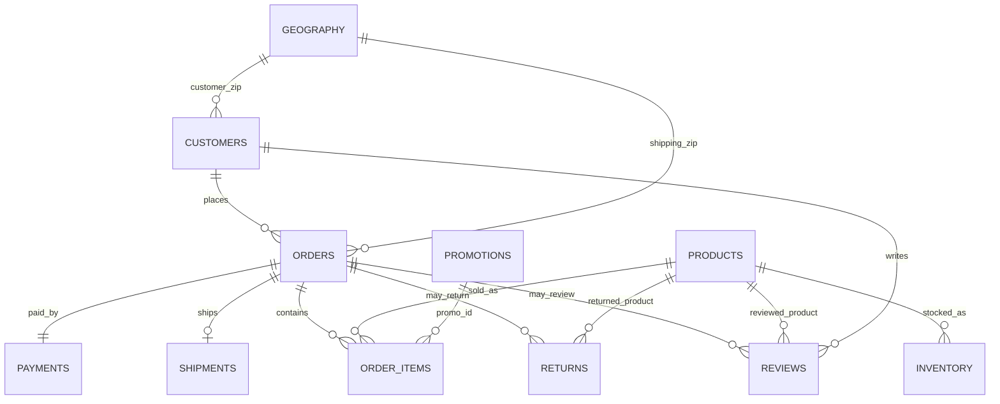

# ERD Notes



## Relationship Rules

- `orders` to `payments`: 1:1.
- `orders` to `shipments`: 1:0 or 1 depending on order status.
- `orders` to `returns`: 1:0 or many.
- `orders` to `reviews`: 1:0 or many.
- `order_items` to `promotions`: many:0 or 1 through `promo_id`.
- `products` to `inventory`: 1:many at product-month grain.

## Tableau Modeling Guidance

Use Tableau relationships rather than physical joins for full-detail exploration:

- `orders_enriched.order_id` -> `order_items_enriched.order_id`
- `order_items_enriched.product_id` -> `inventory_monthly.product_id` only for product-detail sheets
- Keep `daily_kpi`, `growth_forecast_monthly`, and `seasonality_indices` as separate analytical sources unless a single trend worksheet needs them together.

## Power BI Modeling Guidance

Avoid active relationship loops between date, order, and line-item tables.

Recommended active Power BI path for line-item pages:

```text
DimDate[Date] -> orders_enriched[order_date] -> order_items_enriched[order_id]
```

Do not also keep this relationship active:

```text
DimDate[Date] -> order_items_enriched[order_date]
```

Keeping both active creates an ambiguous filter path from `DimDate` to `order_items_enriched`. If line-item-only date measures are needed, make `DimDate -> order_items_enriched` inactive and activate it only in specific DAX measures with `USERELATIONSHIP`.
